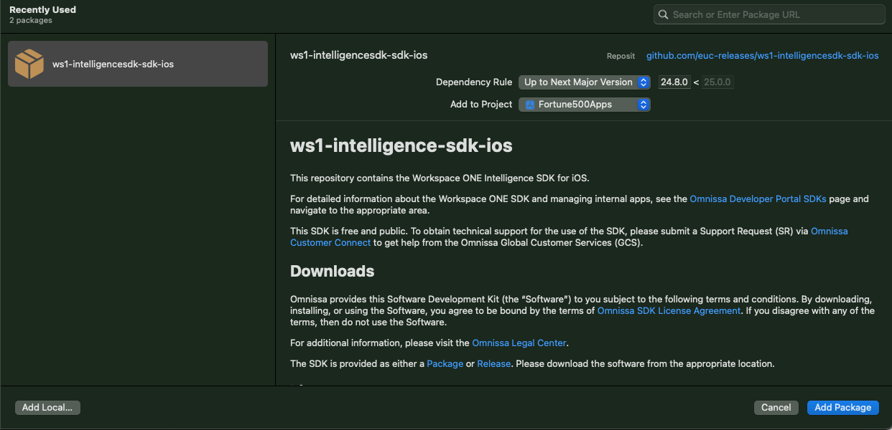
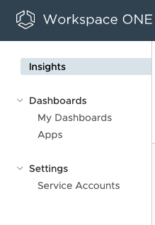
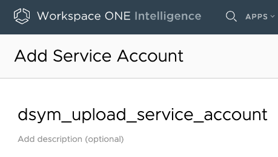

!!!Note
    Cocoapods is no longer supported as a means of installing Workspace ONE Intelligence SDK. Please use Swift Package Manager as described below.
    The Crittercism framework is no longer supported. Use the WS1IntelligenceSDK framework.

Add the Workspace ONE Intelligence SDK Swift Package Manager (SPM) package from this URL:
    https://github.com/euc-releases/ws1-intelligencesdk-sdk-ios.git



## Basic Setup

Obtain your app ID from Workspace ONE Intelligence platform.

### 1. Import the Workspace ONE Intelligence SDK header.

!!!Note
    SDK imports must now be from the “WS1IntelligenceSDK” module rather than the “WS1Intelligence” module.

For Objective-C apps, import the Workspace ONE Intelligence SDK header in your application delegate’s implementation file. 

```objective-c
#import <WS1IntelligenceSDK/WS1Intelligence.h>
```

For Swift applications, place this import in your bridging-header.h file.

```Swift
import WS1IntelligenceSDK
```

### 2. Enable Workspace ONE Intelligence SDK.

Call `enableWithAppID` in your AppDelegate’s `application:didFinishLaunchingWithOptions:` method.

```C
- (BOOL)application:(UIApplication *)application didFinishLaunchingWithOptions:(NSDictionary *)launchOptions {
  [WS1Intelligence enableWithAppID:@"YOUR APP ID GOES HERE"];
  // other code for your app
  return YES;
}
```

```Swift
func application(_ application: UIApplication, didFinishLaunchingWithOptions launchOptions: [UIApplicationLaunchOptionsKey: Any]?) -> Bool {
  WS1Intelligence.enable(withAppID: "YOUR APP ID GOES HERE")
  // other code for your app
  return true
}
```

Register your app at the Workspace ONE Intelligence portal to get an App ID to be used in place of "YOUR APP ID GOES HERE".

### Setup Automatic dSYM Uploads.

!!!Note
    Changes to the Intelligence system credentials files require developers to update to version 24.1.0 or later of dsym_upload.sh. If you have older versions of credentials files, you should regenerate them with the [instructions in this page](#generate-credentials-files). You will only need to regenerate each credentials file once.

!!!Warning
    Please note that cURL (a dependency for the script) has a known issue which may cause a failure inside the script while uploading large dSYM files. The version of cURL that ships with the latest OSX builds has been confirmed to exhibit this issue (7.64.1). If you experience problems during the upload phase of the script, try to upgrade to a newer version. Version 7.69.1 has been confirmed to resolve the issue.

- Download [WS1IntelligenceSDKDSYMUpload.zip](https://github.com/euc-releases/ws1-intelligencesdk-sdk-ios/releases/download/24.3.0/WS1IntelligenceSDKDSYMUpload.zip) and expand the zip file.
- Place the 2 files in an appropriate place in your project.
- In your Xcode application target’s “Build Phases” tab, add a new Run Script phase.


- Copy and paste the script code below into the Run Script phase, then update the path components to the directory you chose.

```bash
APP_ID="<YOUR_APP_ID>"
CREDENTIALS_FILE="${SRCROOT}/<PATH_TO_CREDENTIALS_FILE>"
source "${SRCROOT}/<PATH_TO_SCRIPT>/dsym_upload.sh"
```

You will need to add the included xcfilelist file in the ‘Input File Lists’ section.

```bash
$(SRCROOT)/<PATH_TO_SCRIPT>/dsym_upload.xcfilelist
```

When you build your Xcode application, the dSYM files for your application (and any dependent modules to which you added the Run Script) will be uploaded to Workspace ONE Intelligence and become available for crash symbolication.

## Generate dSYM Files in Build

DWARF dSYM file generation can be toggled in the build options for the target. If you attempt to run the script without dSYM generation enabled, then the script will fail. Select ‘DWARF with dSYM File’ to generate the dSYM file.


## Generate Credentials File from Workspace ONE Intelligence Platform

- Log into the Workspace ONE Intelligence Platform and click the "Service Accounts" menu.



- At the top of the page, click the "Add" button to add a new account.


- Name the service account as desired.



- Click "GENERATE CLIENT SECRET" button.


- Save the .json file to your source repository and amend the path in the Xcode Script Phase

### Common dSYM Upload Issues

- HTTP 403 Authentication Error

This most often occurs due to a missing, expired, or incorrect credentials file. Ensure that the correct credentials file is being used. This type of authentication error can also occur if the script is obtaining an incorrect app ID. Please verify in the logs that the correct app ID is being used.

- PROTOCOL_ERROR Failure during cURL Upload

It has been observed that the default cURL version which ships with current OSX builds may exhibit a known issue when uploading dSYM files. If you experience problems during the upload phase of the script, try to upgrade to a newer version. cURL version 7.69.1 and above has been verified to resolve this problem.

```C
HTTP/2 stream 1 was not closed cleanly: PROTOCOL_ERROR (err 1)
```

- The dSYM upload script causes Xcode build to fail

The script will cause a build failure by default. This behavior is possible to disable by toggling a flag inside the script itself. You may wish to change this setting if you are building without internet access, or for other similar reasons. Note that crash symbolication cannot be completed without a matching dSYM for a particular build of an app.

```C
REQUIRE_UPLOAD_SUCCESS=${REQUIRE_UPLOAD_SUCCESS:=0}
```

Your app is now integrated with Workspace ONE Intelligence! Additional features require adding more code to your project.

## Interoperability with other SDKs

Recommended initialization orders:

### Crashlytics:

Workspace ONE Intelligence SDK should be initialized before Crashlytics

Objective-C

```objective-c
[WS1Intelligence enableWithAppID:@"YOUR APP ID GOES HERE"];

// Initialize Crashlytics
```

Swift

```Swift
WS1Intelligence.enable(withAppID: "YOUR APP ID GOES HERE")

// Initialize Crashlytics
```

### AppDynamics:

AppDynamics should be initialized before Workspace ONE Intelligence SDK

```C
Objective-C

// Initialize AppDynamics

[WS1Intelligence enableWithAppID:@"YOUR APP ID GOES HERE"];
```

Swift

```Swift
// Initialize Crashlytics

WS1Intelligence.enable(withAppID: "YOUR APP ID GOES HERE")
```

### New Relic:

Workspace ONE Intelligence SDK should be initialized before New Relic

Objective-C

```C
[WS1Intelligence enableWithAppID:@"YOUR APP ID GOES HERE"];

// Initialize New Relic
```

Swift

```Swift
WS1Intelligence.enable(withAppID: "YOUR APP ID GOES HERE")

// Initialize New Relic
```